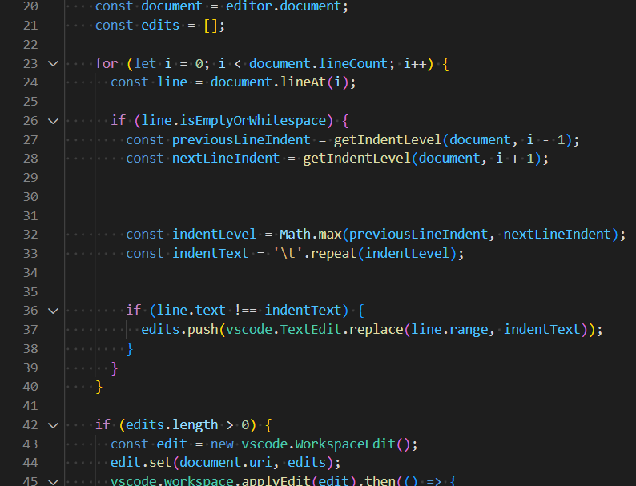

# fightpits README

This extension is nice when you use a language server which doesn't automatically tab up empty lines for you when you hit tab, which is like all of them.

## Features

This extension provides a single command `pitFighter.fixPits (Fix pits)`. First, it will auto-detect the indentation style of the focused editor's file by comparing the sum of the starting whitespace on every line. Second, it will parse through your document and determine whether it will add the detected whitespace up to the previous or next line whitespace column end. Third, it will make edits. Edits can be undone with ctrl-z like any other edit.

## Requirements

No requirements.

## Extension Settings

No settings.

## Release Notes

### 1.0.1

- Added pitFighter.fixPits command

### 1.0.0

Initial release of PitFighter.

---

**Enjoy!**
